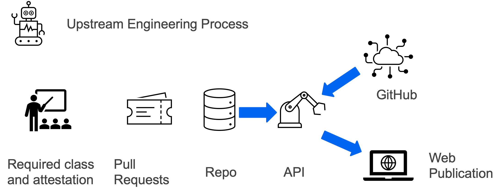

#  Upstream Engineering API

## Introduction

This api is a good starting point for pulling together an automated open source contribution workflow inside an organization.  We have implemented it in the following steps, though the requirements for your organization may vary:

1. Established and published policies to allow publishing code to an open source project under certain conditions and with appropriate approvals.  The level of rigor for this step will be unique to each organization and is not otherwise represented in this repo.
1. Developed a training module and published through a self service learning platform such as [Moodle](https://moodle.org/).  The module covers policies and procedures, tests knowledge and then requires user attestation. This step will be unique to each organization and is not otherwise represented in this repo.
1. Created a simple GitHub repo with only two required files:
    - Approved-communities.md
    - contributors.text
1. Developers wishing to contribute to an existing public open source project or publish a new original open source project under our [Optum GitHub Org](https://github.com/Optum) then:
    - After taking the training class, submit a PR against the contributors.txt file to include their public GitHub identity
    - After obtaining appropriate approvals and endorsements per policy, submit a PR against the approved_communities.md file to have the desired public repo added.
1. Each morning, this api is executed to perform several tasks:
    - check each public GitHub id in the contributors.txt file against each approved open source community in the Approved-communities.md file to pull PR records and associated metadata.
    - data is inserted into both a PostgreSQL database and two files are created for publication:
      - communities.json
      - contributors.json
1. This data is then made available via this api for internal consumption by several docusaurus sites.  The two json files are then pushed to our public [optum.github.io](https://optum.github.io/) site.

## Installation

Install dependencies

npm install

---

## Database

The codebase contains example of implementing using TypeORM [TypeORM](http://typeorm.io/) with a postgres database.

Create a new postgres database with the name `upstreamengineering`\
(or the name you specified in the enviroment variables)

Set database settings using an enviroment variable file development.env :

    API_PORT=3000
    TRANSPORT_PORT=4000
    JWT_SECRET_KEY=rxPhglGJWPlOW596
    JWT_EXPIRATION_TIME=3600

    DB_HOST=localhost
    DB_PORT=5432
    DB_USER=dbuser
    DB_PASSWORD=dbpassword
    DB_DATABASE=upstreamengineering

On application start, tables for all entities will be created.

---

## NPM scripts

-   `npm start` - Start application
-   `npm run start:watch` - Start application in watch mode
-   `npm run test` - run Jest test runner
-   `npm run start:prod` - Build application

## Start application

-   `npm start`
-   Test api with `http://localhost:3000/api/articles` in your favourite browser

---

# Authentication

This applications uses JSON Web Token (JWT) to handle authentication. The token is passed with each request using the `Authorization` header with `Token` scheme. The JWT authentication middleware handles the validation and authentication of the token. Please check the following sources to learn more about JWT.

---

# Swagger API docs

The NestJS swagger module for API documentation. [NestJS Swagger](https://github.com/nestjs/swagger) - [www.swagger.io](https://swagger.io/)
